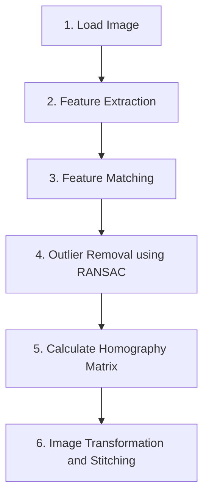

## 이미지 스티칭 (Image Stitching)
이미지 스티칭이란 **여러 장의 사진**에 대하여 접합을 하여 **한 장의 사진**으로 만드는 기술을 의미한다.

이미지 스티칭을 구현하기 위하여 OpenCV를 활용하여 기본 개념들과 함께 천천히 구현해 나갈 예정이다.
<p align="center">
  
  feature matching
</p> 

## 이미지 스티칭 구현 과정

일반적으로 이미지 스티칭의 구현 과정은 아래과 같다.

1. 이미지 로드
2. 특징점 검출기(Feature Extractor)를 통한 특징점 검출(Feature Extraction)
3. 검출된 특징점들에 대해 특징점 매칭(Feature Matching) 진행
4. RANSAC(RANdom Sample Consensus)을 이용한 Outlier 제거
5. 특징점 매칭 결과를 통한 Homography Matrix 도출
6. Homography Matrix를 통한 이미지 변환 및 결합



컴퓨터 비전 분야에서 특징점 매칭은 여러 이미지 간의 공통된 특징을 찾아내는 중요한 기술이다. 이를 통해 이미지 간의 대응점을 찾고, 변화나 움직임을 추적할 수 있다. 특징점 매칭의 과정은 크게 두 가지 단계로 나뉜다: 특징점 검출과 특징점 매칭(Feature Matching)이다.

## 1. 특징점 검출 (Feature Extraction)

이미지에서 특징을 검출하기 위해서는 이미지 내부의 독특한 패턴이나 구조를 찾아내는 것이 중요하다. 이를 위해 다양한 알고리즘이 사용된다.

- **SIFT (Scale-Invariant Feature Transform)**: 이미지 크기와 회전에 불변성을 가지며, 다양한 상황에서 안정적인 성능을 보여준다. DoG(Difference of Gaussians)를 사용하여 다양한 스케일에서 특징점을 검출하고, 각 특징점을 128차원의 벡터로 설명한다.
- **SURF (Speeded-Up Robust Features)**: SIFT의 계산 속도를 개선한 알고리즘으로, 빠른 속도를 제공하면서도 좋은 성능을 유지한다. 해시안 행렬의 결정을 기반으로 특징점을 검출하고, 64차원 또는 128차원 벡터로 특징을 설명한다.
- **ORB (Oriented FAST and Rotated BRIEF)**: 빠르고 효율적인 특징점 검출 및 디스크립터 알고리즘으로, 특히 실시간 응용 프로그램에 적합하다. FAST 검출기와 회전에 강인한 BRIEF 설명자를 결합하여 사용한다.
- **BRISK (Binary Robust Invariant Scalable Keypoints)**: 스케일 공간에서 패치를 이용해 특징점을 검출하고, 이를 바이너리 디스크립터로 기술한다. AGAST 알고리즘을 사용하여 코너를 검출하고, 특징의 방향성을 식별하여 회전 불변성을 제공한다.
- **AKAZE (Accelerated-KAZE)**: KAZE의 변형으로, 더 빠른 처리를 가능하게 하면서도 특징점 검출 후, 해당 특징점의 방향에 따라 디스크립터를 생성한다. Fast Explicit Diffusion(FED) 프레임워크를 사용하여 계산 효율성을 높인다.

## 2. 특징점 검출

고유한 특징을 나타내는 점들을 집합한 것을 특징점(feature point) 또는 키포인트(keypoint) 또는 관심점(interest point)라고 한다. 특징점 주변의 부분 영상을 잘라서 특징점에 대한 특징을 기술하는 방법을 기술자(descriptor) 또는 특징 벡터(feature vector)라고 한다. 두 개의 영상이 같은지 다른지 판별하기 위해 매칭을 할 때 특징점을 활용한다.

## 3. 크기 불변 특징점 검출 방법

SIFT, KAZE, AKAZE, ORB 등 다양한 특징점 검출 방법에서 스케일 스페이스(scale-space), 이미지 피라미드(image pyramid)를 구성하여 크기 불변 특징점을 검출한다. 스케일 스페이스(Scale Space)는 리사이즈와 가우시안 블러링을 여러 번 하는 방법이다. 가우시안 블러링을 통해 초점이 맞지 않는 가상의 영상을 만들어 완전한 코너는 아니지만 반복적으로 검출될 수 있는 점들을 검출하는 형태로 구현한다. 대표적인 예가 SIFT이다.

## 4. OpenCV 특징점 검출 클래스 - Feature2D 클래스와 파생 클래스

OpenCV에서 여러 가지 특징점 검출 방법이 구현되어 있다. Feature2D 클래스에 자식 클래스 형태로 구현되어 있으며, Feature2D 클래스에 선언된 `detect()`, `compute()`, `detectAndCompute()` 함수는 자식 클래스에서도 이용할 수 있다. SIFT와 SURF는 특허가 걸려있어 상업적으로 이용할 때는 특허료를 내야 한다. 하지만 SIFT는 특허가 만료되어 4.4 버전부터 사용이 가능하다. 다양한 방법들이 있으며, KAZE, AKAZE, ORB가 유명하므로 예제 코드에서 세 가지 방법만 구현해 보겠다.

## 5. 비교 분석
아래 논문에서 비교 분석한 내용을 바탕으로 각 알고리즘에 대해 정리 해보았다. 

["A Comparative Analysis of SIFT, SURF, KAZE,
AKAZE, ORB, and BRISK"](https://www.researchgate.net/publication/323561586_A_comparative_analysis_of_SIFT_SURF_KAZE_AKAZE_ORB_and_BRISK).

### 1. 특징 검출 성능
- **ORB**가 가장 많은 특징점을 검출했음
- **BRISK**는 두 번째로 많은 특징점을 검출했으며, **SIFT**, **SURF**, **KAZE**, **AKAZE**보다 많은 특징점을 검출했음
- **SURF**는 **SIFT**보다 많은 특징점을 검출했음
- **AKAZE**는 일반적으로 **KAZE**보다 많은 특징점을 검출했음
- **KAZE**는 가장 적은 특징점을 검출했음
- **SURF(64D)**는 **SURF(128D)**보다 많은 특징을 매칭했음

### 2. 특징점 검출 시간
- **ORB**가 가장 효율적이며, **BRISK**도 효율적임
- **KAZE**는 가장 높은 계산 비용을 요구하며, **SIFT**의 비용은 **KAZE**의 절반 이하임
- **SURF(64D)**와 **SURF(128D)**는 **SIFT(128D)**보다 효율적임
- **AKAZE**는 **SIFT**, **SURF**, **KAZE**보다 효율적이지만 **ORB**와 **BRISK**보다 비쌈

### 3. 특징 매칭 시간
- **SURF(128D)**는 가장 높은 매칭 비용을 요구하며
- **ORB(1000)**가 가장 적은 매칭 비용을 요구함
- **AKAZE**의 매칭 비용은 **KAZE**보다 낮음

### 4. 총 이미지 매칭 시간
- **ORB(1000)**와 **BRISK(1000)**가 가장 빠름
- **SURF(64D)**는 **SIFT**보다 빠르지만 **SURF(128D)**는 그렇지 않음
- **KAZE**는 **SIFT**, **SURF**보다 빠름

### 5. 이미지 매칭 정확도
- **SIFT**는 스케일, 회전 및 아핀 변화에 대해 가장 정확한 알고리즘으로 나타남
- **BRISK**는 스케일 및 회전 변화에 대해 두 번째로 정확했음
- **AKAZE**는 회전 및 스케일 변화에 대해 **BRISK**와 유사한 정확성을 보였음

### 6. 결론
- **특징점 검출 성능**: ORB > BRISK > SURF > SIFT > AKAZE > KAZE
- **특징점 검출 시간**: ORB > ORB(1000) > BRISK > BRISK(1000) > SURF(64D) > SURF(128D) > AKAZE > SIFT > KAZE
- **특징점 매칭 시간**: ORB(1000) > BRISK(1000) > AKAZE > KAZE > SURF(64D) > ORB > BRISK > SIFT > SURF(128D)
- **총 이미지 매칭 시간**: ORB(1000) > BRISK(1000) > AKAZE > KAZE > SURF(64D) > SIFT > ORB > BRISK > SURF(128D)


## 결론

SIFT와 BRISK는 모든 종류의 기하학적 변환에 대해 가장 높은 정확도를 보인다. ORB와 BRISK는 많은 특징점을 검출할 수 있지만, 매칭 시간 때문에 전체 이미지 매칭 시간이 길어질 수 있다. 반면, ORB(1000)과 BRISK(1000)는 가장 빠른 이미지 매칭을 제공하지만 정확도가 다소 낮아진다. 이 논문의 비교 분석은 특정 비전 응용 프로그램에서 가장 적합한 특징점 추출 알고리즘을 선택하는 데 중요한 기준을 제공한다.

## 6. 특징점 검출 예제
```python
import cv2
import numpy as np
import matplotlib.pyplot as plt
import os

# 결과 저장 폴더
output_dir = "output_features"
if not os.path.exists(output_dir):
    os.makedirs(output_dir)

# 이미지 읽기
img1 = cv2.imread('ex1.jpg', cv2.IMREAD_GRAYSCALE)
img2 = cv2.imread('ex2.jpg', cv2.IMREAD_GRAYSCALE)

# 특징점 검출기 리스트
detectors = {
    'ORB': cv2.ORB_create(),
    'BRISK': cv2.BRISK_create(),
    'AKAZE': cv2.AKAZE_create()
}

# 각 특징점 검출기마다 특징점 검출 및 저장
for name, detector in detectors.items():
    # 키포인트 및 디스크립터 검출
    kp1, des1 = detector.detectAndCompute(img1, None)
    kp2, des2 = detector.detectAndCompute(img2, None)

    # 특징점을 이미지에 그리기
    img1_with_keypoints = cv2.drawKeypoints(img1, kp1, None, color=(0, 255, 0), flags=cv2.DrawMatchesFlags_DRAW_RICH_KEYPOINTS)
    img2_with_keypoints = cv2.drawKeypoints(img2, kp2, None, color=(0, 255, 0), flags=cv2.DrawMatchesFlags_DRAW_RICH_KEYPOINTS)

    # 결과 출력
    plt.figure(figsize=(20, 10))
    plt.subplot(1, 2, 1)
    plt.title(f'{name} Keypoints in Image 1')
    plt.imshow(cv2.cvtColor(img1_with_keypoints, cv2.COLOR_BGR2RGB))
    plt.axis('off')
    
    plt.subplot(1, 2, 2)
    plt.title(f'{name} Keypoints in Image 2')
    plt.imshow(cv2.cvtColor(img2_with_keypoints, cv2.COLOR_BGR2RGB))
    plt.axis('off')
    
    plt.tight_layout()
    plt.show()
```
# 컴퓨터 비전에서의 특징 검출과 매칭

컴퓨터 비전 분야에서 특징 매칭은 여러 이미지 간의 공통된 특징을 찾아내는 중요한 기술이다. 이를 통해 이미지 간의 대응점을 찾고, 변화나 움직임을 추적할 수 있다. 특징 매칭의 과정은 크게 두 가지 단계로 나뉜다: 특징 검출(Feature Detection)과 특징 매칭(Feature Matching)이다.

## 1. 특징 검출 (Feature Detection)

이미지에서 특징을 검출하기 위해서는 이미지 내부의 독특한 패턴이나 구조를 찾아내는 것이 중요하다. 이를 위해 다양한 알고리즘이 사용된다:

- **SIFT (Scale-Invariant Feature Transform)**: 이미지 크기와 회전에 불변성을 가지며, 다양한 상황에서 안정적인 성능을 보여준다.
- **SURF (Speeded-Up Robust Features)**: SIFT의 계산 속도를 개선한 알고리즘으로, 빠른 속도를 제공하면서도 좋은 성능을 유지한다.
- **ORB (Oriented FAST and Rotated BRIEF)**: 빠르고 효율적인 특징 검출 및 디스크립터 알고리즘으로, 특히 실시간 응용 프로그램에 적합하다.
- **FAST (Features from Accelerated Segment Test)**: 매우 빠르게 특징점을 검출할 수 있는 알고리즘으로, 단순하고 빠른 처리가 필요할 때 유용하다.
- **BRISK (Binary Robust Invariant Scalable Keypoints)**: 스케일 공간에서 패치를 이용해 특징점을 검출하고, 이를 바이너리 디스크립터로 기술한다.
- **AKAZE (Accelerated-KAZE)**: KAZE의 변형으로, 더 빠른 처리를 가능하게 하면서도 특징점 검출 후, 해당 특징점의 방향에 따라 디스크립터를 생성한다.

## 2. 특징점 검출

고유한 특징을 나타내는 점들을 집합한 것을 특징점(feature point) 또는 키포인트(keypoint) 또는 관심점(interest point)라고 한다. 특징점 주변의 부분 영상을 잘라서 특징점에 대한 특징을 기술하는 방법을 기술자(descriptor) 또는 특징 벡터(feature vector)라고 한다. 두 개의 영상이 같은지 다른지 판별하기 위해 매칭을 할 때 특징점을 활용한다.

## 3. 크기 불변 특징점 검출 방법

SIFT, KAZE, AKAZE, ORB 등 다양한 특징점 검출 방법에서 스케일 스페이스(scale-space), 이미지 피라미드(image pyramid)를 구성하여 크기 불변 특징점을 검출한다. 스케일 스페이스(Scale Space)는 리사이즈와 가우시안 블러링을 여러 번 하는 방법이다. 가우시안 블러링을 통해 초점이 맞지 않는 가상의 영상을 만들어 완전한 코너는 아니지만 반복적으로 검출될 수 있는 점들을 검출하는 형태로 구현한다. 대표적인 예가 SIFT이다.

## 4. OpenCV 특징점 검출 클래스 - Feature2D 클래스와 파생 클래스

OpenCV에서 여러 가지 특징점 검출 방법이 구현되어 있다. Feature2D 클래스에 자식 클래스 형태로 구현되어 있으며, Feature2D 클래스에 선언된 `detect()`, `compute()`, `detectAndCompute()` 함수는 자식 클래스에서도 이용할 수 있다. SIFT와 SURF는 특허가 걸려있어 상업적으로 이용할 때는 특허료를 내야 한다. 하지만 SIFT는 특허가 만료되어 4.4 버전부터 사용이 가능하다. 다양한 방법들이 있으며, KAZE, AKAZE, ORB가 유명하므로 예제 코드에서 세 가지 방법만 구현해 보겠다.

## 5. 특징점 검출 알고리즘 객체 생성 - cv2.방법_create

특징점 검출을 위해서는 각 클래스를 생성해야 한다.