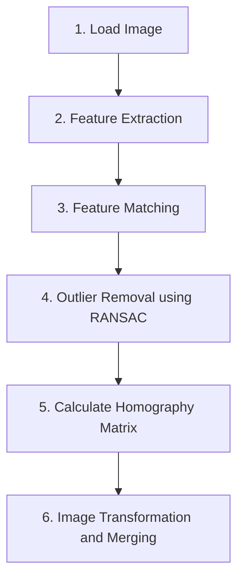

## 1. 이미지 스티칭 (Image Stitching)
이미지 스티칭이란 **여러 장의 사진**에 대하여 접합을 하여 **한 장의 사진**으로 만드는 기술을 의미한다.  

이미지 스티칭을 구현하기 위하여 OpenCV를 활용하여 기본 개념들과 함께 천천히 구현해 나갈 예정이다.

  
  Example of Image Stitching

 

## 2. 이미지 스티칭 구현 과정

일반적으로 이미지 스티칭의 구현 과정은 아래과 같다.

1. 이미지 로드
2. 이미지에 대한 특징점 추출(Feature Extraction)
3. 추출된 특징점들에 대해 특징점 매칭(Feature Matching)
4. RANSAC(RANdom Sample Consensus)을 이용한 Outlier 제거
5. 특징점 매칭 결과를 통한 Homography Matrix 도출
6. Homography Matrix를 통한 이미지 변환 및 결합

앞으로의 포스트는 위와 같은 Flow로 진행이 될 예정이다.  
또한, 다음 포스트는 Homography를 도출하기 위한 첫번째 단계인 특징점 추출(Feature Extration)에 대해 다뤄보려고 한다.